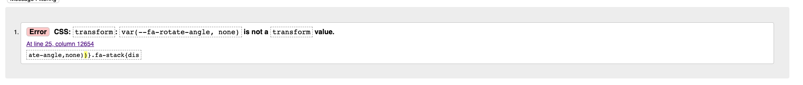

# Song Mates

[Link to deployed site](https://songmates.herokuapp.com/)

## Purpose

Thanks to modern technology, musicians can make great quality recordings at home. There's never been a better time for musicians to be able to express themselves via the 
medium of digital recording. Great music is often the result of collaboration, and while audio technology enables musicians to work with each other remotely, how do you find people to collaborate with?
 
The purpose of Song Mates is to provide a platform for musicians who want to write, perform and record material to find like minded people to collaborate with, whether that be for a song or an album.

Users can register with Song Mates, and create a profile with an image, a biography or summary of what they're looking for, and can specify the instruments they play and relevant skills. They can search for potential collaborators using these criteria, and make collaboration requests (like a connection request on LinkedIn or friend request on Facebook). Users can send direct messages to their  connections.

**Important**

Song mates is a work in progress. The backend is in place and key features for a minimum viable product have been implemented, however styling/design has not been completed. At least one additional feature (user to user messaging) will be implemented for the final version, to be completed by mid-November 2022.

## Table of contents

## User stories

## Agile development methodology

## Features

### Future improvements and features

- There is currently a lot of HTML duplicated between the `find_collabs.html` and `single_profile.html` templates. These could be refactored into a single template, but this would require passing in additional data and adding conditional statements to the template to determine whether it should render as a single profile or multiple profiles (e.g. this would influence whether or not to render search features, the correct heading for the page etc).
- The code to process the search form in the `SearchProfiles` class in `views.py` is overly complex and convoluted. This would benefit from refactoring as a priority, however this has not yet been addressed due to time pressures.

**TBC**
- Ability to rate collabs
- Message or reason for uncollaborating
- Send message with collab request
- Organise messages as threads
- Live feedback on character limit on forms
- Option for users to hide their profile from unauthenticated users
- Distinguish between 'read' and 'unread' messages so that only unread messages are show in the navbar, and ability to mark messages as read or unread
- Enable users to include SoundCloud and Youtube clips in their profiles
- User reporting functionality
- Mechanism to easily contact the site admin
- Masonry layout
- Feature to mark accounts as 'hidden', e.g. an admin account - although this can be achieved now by maintaining an empty profile
- Ability to login with social media accounts
- Better account management functionality, e.g. change username, change password, add email account verifications

## Planning

## Frameworks, libraries and dependencies

### Django 3.2

### Psychopg 2
Python PostgreSQL adapater

### Gunicorn
Python WSGI HTTP server

### dj-database-url
Django utility to create an environment variable to configure the Django application

### Django-allauth
User account management django application suite

### Cloudinary and django-cloudinary-storage
Libraries to enable storage of static files and media in Cloudinary

### Crispy Forms
Django app to simplify form rendering

### Crispy Bootstrap 5
Bootstrap 5 templates for Crispy Forms

### Bootstrap 5
Front end CSS and JavaScript library

## Data model

## Testing

### Fixed bugs
- Testing of the update profile form showed that profile pictures were not uploading to cloudinary. This was rectifed by adding the `enctype="multipart/form-data"` attribute to the form element.
- While testing the search feature, it was realised that if the user did not select any genres, no profiles would be returned. This was fixed by adding a simple conditional statement to ensure that profiles are not filtered by genre if no genres are selected.
- During testing, it was found that the 'Show my collaborators only' checkbox on the search form was overriding other search results. For example, if a genre of 'Hip-Hop' was selected in the genres menu and the checkbox to show collaborators only was selected, collaborators would show in the search results even if none of them were matched with the 'Hip-Hop' selection. The correct outcome in this case would be no search results. This was bug was caused by an incorrect boolean condition in an if statement and easily fixed.
- Non-authenticated users using the search function resulted in a server error. This was caused by an attempt to reference the user's profile in the `SearchProfile` view. This was fixed by moving the offending code inside a conditional statement checking for an authenticated user.
- Testing uploading an invalid  profile image resulted in an error. This was fixed by adding a try/except block to the view code. A Django message is displayed within the except block in the event of an error.
- The modal dialog for sending a user to user message in the Find Collaborators page was always displaying the name of the first user profile in the list, no matter which user selected to send a message to. This was because Bootstrap modals must have a unique `id` attribute. All the modals had been given the same `id` within the `for` loop that renders profiles. This was also the case for the corresponding `data-bs-modal` attribute of the buttons used to open the modal from each profile. This was fixed by appending the primary key for each user to the modal `id` and button `data-bs-modal` attribute.
- The modal dialogs for rejecting incoming or cancelling outgoing collaboration requests were targetting the incorrect users, meaning that when there were multiple collaboration requests for one user, the incorrect one would be deleted from the database. This was for a similar reason to the above issue with user messages, and was fixed by moving the modals within the for loop and applying unique `id` attributes to the forms and buttons for each collaboration request.
- The 'Show only my collaborators' checkbox on the search form was always returning no results, even when the user did have collaborators. This was fixed by additional checks for empty querysets and whether the checkbox has been selected in `SearchProfile` class in `views.py`.

### Manual testing

### Automated tests

### Validator testing

- The W3C HTML validator detected issues with:
    - Three HTML character codes which were not terminated with a `;`  in the navbar and the footer.
    - An element with an opening `<button>` tag and closing `<a>` tag in `find_collabs.html`.
    - The `onchange` attribute for the checkbox on the search form was incorrectly spelt `on-change`. This highlighted that this attribute was a 'hangover' from the development process and had been replaced by an event listener added to the element via JavaScript, so was removed altogether.
    - The `rows` attribute used on the form in the send message modal in the `find_collabs.html` template had been mispelt.
    - Duplicate `id` attributes were found for the modals and forms used to confirm deletion of a collaboration relationship, and for the `form` elements used to send a collaboration request in `find_collabs.html`.
    - Modals were being rendered with `id` attributes referencing non-existent forms in`find_collabs.html`. This error was rectified by wrapping the modal code in an `if`...`endif` block within the HTML template, to check whether a modal would be required for that particular user profile.
    - A similar issue with modals being rendered with `id` attributes referencing non-existent forms was also present in `messages.html`. This only affected outgoing messages, and was rectified by moving an `endif` to ensure that modals are only rendered if there is an associated form.
    - Modals were being rendered inside tables in `collab_requests.html` and `messages.html`. This was fixed by moving the modals into a separate for loop within the HTML template.
    

The above errors were all rectified.

The validator also produced the following information about closing slashes on void elements. These are inserted into the HTML by Django or CrispyForms when forms are rendered, and so can't be easily fixed, however since this is not regarded as an error, this was deemed satisfactory:

All pages of the site pass HTML validation with one exception. The validator flags one error which is caused by a font-awesome script. A Google search did not result in any helpful material. Since the error is in font-awesome's code, it could not be fixed, however the site functions correctly and no errors are reported with SongMates custom HTML, so the site was deemed to have passed HTML validation on that basis. A GitHub issue has been opened with Font Awesome. 

- The custom CSS for the site passed through the W3C Jigsaw CSS validator with no issues

*Done - home, collab requests!, find collabs!, messages, sign-in, sign-up, profile form, sign-out*

##  Bugs

Initially, allauth configuration was set to require the user to login with an email address and for email verification to be required. However, this caused a Django 'connection refused' error. This was caused by the fact no email server was availabe to send verification request emails. Settings were changed so that account login is by username rather than email address. 

### Resolved bugs

### Unresolved bugs

## Deployment

## Credits

### Code

- The steps to connect to a Heroku Postgres database and deploy were adapted from the Code Institute 'I think therefore I blog' tutorial. This includes defining `DATABASE_URL` and `SECRET_KEY` environment variables in an `env.py` file in the local environment and adding corresponding config variables in the Heroku dashboard, using dj_database_url to create a URL from the Heroku database URL in `settings.py`, updating `ALLOWED_HOSTS` in `settings.py` with the deployed Heroku URL and adding the templates path to a `TEMPLATES_DIR` variable in `settings.py`.
- This [stackoverflow article](https://stackoverflow.com/questions/68810221/login-required-decorator-gives-object-has-no-attribute-user-error) was referenced to understand how to use the 'login-required' decorator with a class based view
- The approach to deleting a user account (actually making the account inactive) in response to a button was adapted from [this stackoverflow article](https://stackoverflow.com/questions/38047408/how-to-allow-user-to-delete-account-in-django-allauth)
- The Bootstrap 5 documentation was extensively referenced for guidance on implementing navbars and modal dialogs.
- The approach to using a crispy form Div helper class to layout form elements next to each other was based on [this stackoverflow article](https://stackoverflow.com/questions/23021746/get-two-fields-inline-in-django-crispy-forms-but-not-others-horizontal)
- The approach to using the crispy forms HTML help class to display an image from the database model in a form was based on (https://stackoverflow.com/questions/21076248/imagefield-preview-in-crispy-forms-layout)
- The approach to using a custom template tag to pass data to the base HTML template was adapated from (https://stackoverflow.com/questions/21062560/django-variable-in-base-html) and then refined with reference to the official Django documentation.
- This [stack overflow question](https://stackoverflow.com/questions/53672002/how-to-call-conditional-statements-on-template-tags-with-no-arguments-django) was referenced for details on how to convert a custom template tag to a variable in Django template.
- The technique for displaying values of a many to many field in the admin panel was adapted from [stack overflow question](https://stackoverflow.com/questions/18108521/many-to-many-in-list-display-django)
- This [stack overflow question](https://stackoverflow.com/questions/21666963/django-forms-multiplechoicefield-only-selects-one-value) was referenced to discover how to access a list of values returned by a multiple choice Django form element.
- The technique of using an `initial` argument when initialising a form to set a form input's initial value is from (https://stackoverflow.com/questions/604266/django-set-default-form-values)
- Using the `_in` lookup parameter to find out if the value of a field exists within a list was adapated from (https://stackoverflow.com/questions/70703168/check-if-each-value-within-list-is-present-in-the-given-django-model-table-in-a)
- The syntax for searching on a property of a foreign key object is adapated from (https://stackoverflow.com/questions/35012942/related-field-got-invalid-lookup-icontains)
- The technique for overriding the save method of a Django model class in order to compute the value of a field based on the values of other fields is adapted from(https://stackoverflow.com/questions/22157437/model-field-based-on-other-fields)
- The technique for identifying the currently active link in the navbar and conditionally applying classes is from (https://stackoverflow.com/questions/46617375/how-do-i-show-an-active-link-in-a-django-navigation-bar-dropdown-list)
- Using the JavaScript `setTimeout()` function to automatically dismiss Django messages was adapted from the Code Institute Django Blog walkthrough.
- This [Stack Overflow](https://stackoverflow.com/questions/35777410/multi-modals-bootstrap-in-for-loop-django) question was referenced to fix the issue with modals opening for the incorrect user when sending a message from the Find Collaborators page.
- This [Stack Overflow](https://stackoverflow.com/questions/19024218/bootstrap-3-collapse-change-chevron-icon-on-click) question was referenced for a solution to changing the icon displayed depending on the state of a Bootstrap collapse item.
- This [Stack Overflow](https://stackoverflow.com/questions/36940384/how-do-i-setup-a-unit-test-user-for-django-app-the-unit-test-cant-login) article was referenced to understand how to create a test user for Django unit tests.
- The technique to conditionally add a local database for unit tests within the `settings.py` file is from [this Stack Overflow artice](https://stackoverflow.com/questions/4650509/different-db-for-testing-in-django).
- The technique to ensure the latest state of the user is loaded from the database within a unit test is from [Stack Overflow](https://stackoverflow.com/questions/64741329/why-is-my-test-function-not-activating-the-user).
- This [Stack Overflow](https://stackoverflow.com/questions/910169/resize-fields-in-django-admin) article was referenced to understand how to resize fields in the Django admin panel forms.

### Content

- Font Awesome icons
    - [Burger menu icon](https://fontawesome.com/icons/bars?s=solid&f=classic)
    - [Collaborator icon](https://fontawesome.com/icons/user?s=solid&f=classic)
    - [Information icon](https://fontawesome.com/icons/circle-info?s=solid&f=classic)
    - [User pen icon](https://fontawesome.com/icons/user-pen?s=solid&f=classic)
    - [Envelope icon](https://fontawesome.com/icons/envelope)
    - [Down chevron icon](https://fontawesome.com/icons/chevron-down?s=solid&f=classic)
    - [Up chevron icon](https://fontawesome.com/icons/chevron-up?s=solid&f=classic)
- **Google Fonts TBC**
- Placeholder profile image by WandererCreative and downloaded from [Pixabay](https://pixabay.com/images/id-973460/)
- Vinyl record image used in the logo by Paul Brennan and downloade from [Pixabay](https://pixabay.com/photos/phonograph-record-vinyl-audio-sound-3148686/)
**???***
- Hero image of guitar amplifier by dmkock and downloaded  from [Pixabay](https://pixabay.com/photos/electric-guitar-amplifier-amplifier-640683/) 
- Hero image of red vinyl record by Stas Knop and downloaded from [Pexels](https://www.pexels.com/photo/red-vinyl-record-3552948/)
- Profile images for test user accounts:
    - ElizaB's image is from [Freepik](https://www.freepik.es/vector-premium/dibujo-dibujos-animados-cantante_20243817.htm)
    - Luna's image is from [Pixabay](https://pixabay.com/photos/cat-tree-climb-kitten-domestic-cat-2902599/)
    - Trumpet_Mike's image is from [Pixabay](https://pixabay.com/photos/music-instrument-trumpet-metal-624421/)
    - Elvis' image is from [Pixabay](https://pixabay.com/photos/elvis-elvis-presley-musician-1269775/)
    - holy_grail_42's image is from [Pixabay](https://pixabay.com/photos/forest-girl-trees-fog-lantern-3833973/)
    - Lauren's image is from [Pixabay](https://pixabay.com/photos/announcer-audio-black-cassette-316586/)